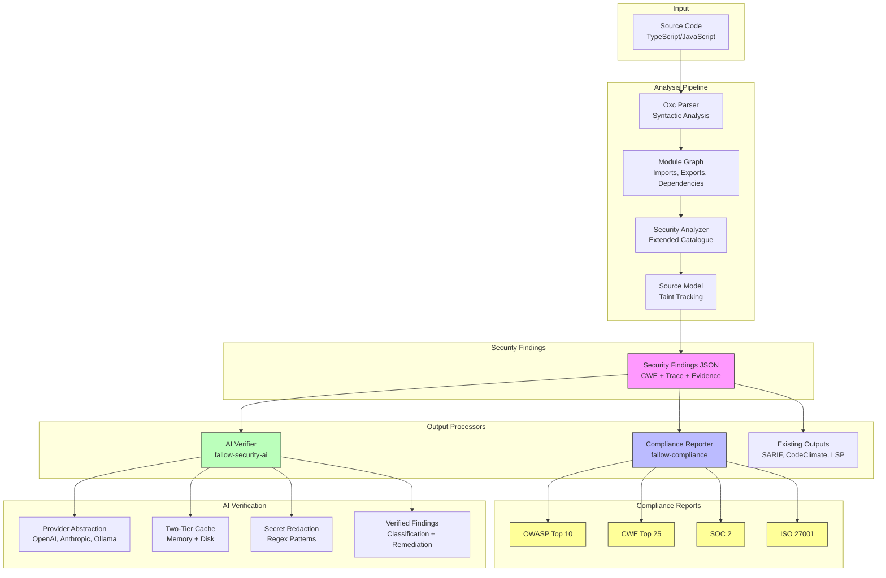
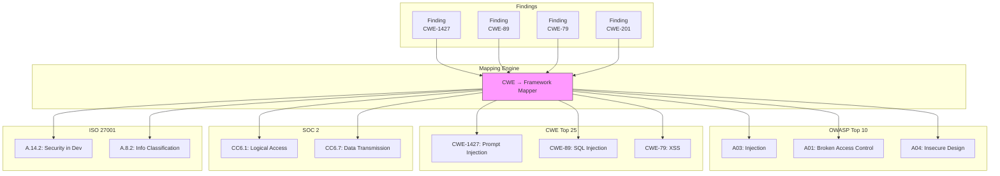
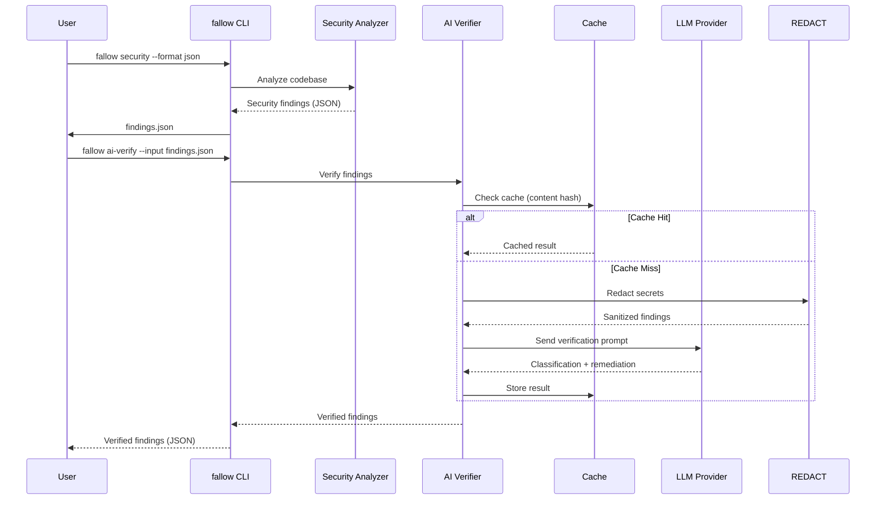
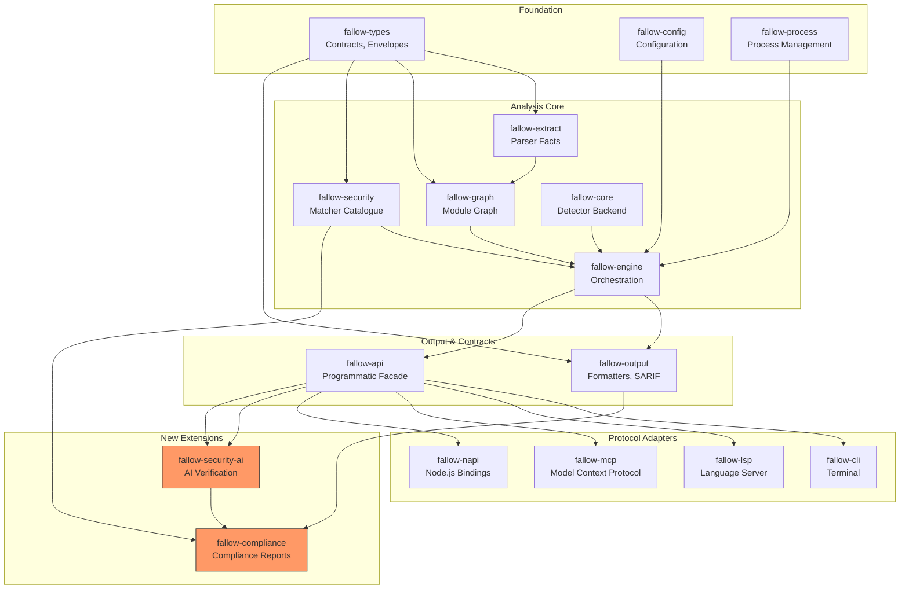
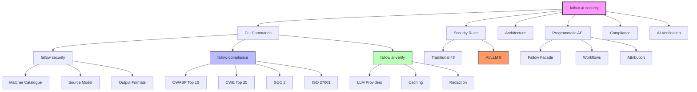
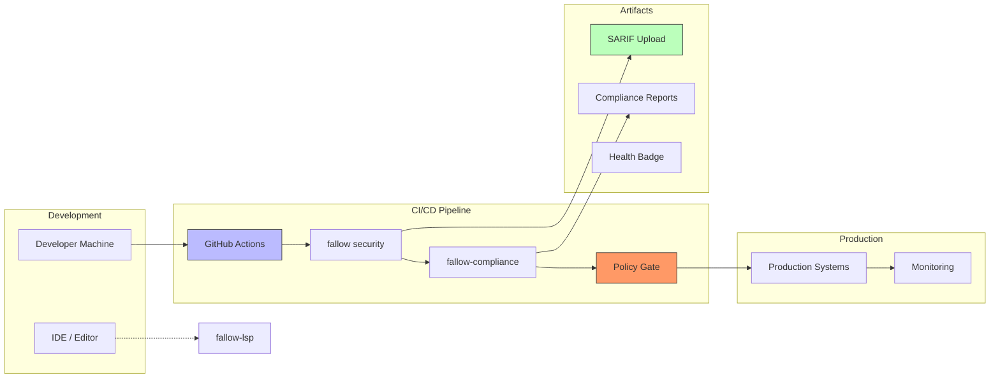

# Architecture Visualization

## System Overview



## Security Matcher Catalogue

```mermaid
flowchart LR
    subgraph "Traditional Categories (48)"
        XSS[CWE-79: XSS\nHTML sinks]
        SQLI[CWE-89: SQL Injection]
        CMDI[CWE-78: Command Injection]
        SSRF[CWE-918: SSRF]
        PATH[CWE-22: Path Traversal]
        XXE[CWE-611: XXE]
        PROTO[CWE-1321: Prototype Pollution]
        CRYPTO[CWE-327: Weak Crypto]
        -- -- -- --
        OTHER[41 more categories]
    end

    subgraph "AI/LLM Categories (8 NEW)"
        LLM1[CWE-1427: Prompt Injection\nllm-call-injection]
        LLM2[CWE-1427: Agent Tool Misuse\nagent-tool-misuse]
        LLM3[CWE-201: Data Exfiltration\nllm-data-exfiltration]
        LLM4[CWE-1336: RAG Poisoning\nrag-poisoning]
        LLM5[CWE-922: Insecure Agent State\ninsecure-agent-state]
        LLM6[CWE-94: MCP Tool Injection\nmcp-tool-injection]
        LLM7[CWE-1427: System Prompt Override\nllm-system-prompt-override]
        LLM8[CWE-1427: Output Parsing Injection\nagent-output-parsing-injection]
    end

    style LLM1 fill:#f96,stroke:#333
    style LLM2 fill:#f96,stroke:#333
    style LLM3 fill:#f96,stroke:#333
    style LLM4 fill:#f96,stroke:#333
    style LLM5 fill:#f96,stroke:#333
    style LLM6 fill:#f96,stroke:#333
    style LLM7 fill:#f96,stroke:#333
    style LLM8 fill:#f96,stroke:#333
```

## Compliance Mapping



## AI Verification Flow



## Crate Dependency Graph



## Interactive Documentation Tree



## Deployment Architecture



---

*Generated as part of fallow-ai-security documentation*  
*View interactive version at: https://github.com/nakisisageorge/fallow-ai-security/tree/main/docs/architecture*